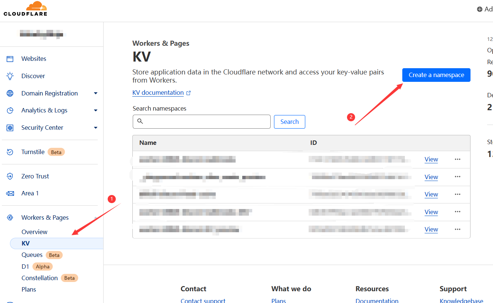

# Worker-Bilibili-Discord

部署在Cloudflare Worker上，定时抓取特定用户的B站动态并推送到Discord中

**因B站激进反爬，不想与其玩猫鼠游戏，目前B站投稿监控功能不可用**  
参见 [SocialSisterYi/bilibili-API-collect/issues/686](https://github.com/SocialSisterYi/bilibili-API-collect/issues/686)  
以及 [SocialSisterYi/bilibili-API-collect/issues/868](https://github.com/SocialSisterYi/bilibili-API-collect/issues/868)  
## 安装

确保你已经安装了node环境以及npm等包管理器（https://nodejs.org/en）

克隆本项目到本地，打开命令行，输入 
```bash
npm i -g pnpm # 若已安装 pnpm，可跳过

pnpm i
```

## 使用
### 自定义
首先需要登录到 cloudflare
```bash
npx wrangler login
```

然后修改`wrangler.toml`，内容类似下方
```toml
name = "worker-bilibili-discord"
main = "src/index.ts"
compatibility_date = "2023-06-15"

[[kv_namespaces]]
binding = "FEED_CACHE"
id = "795fae2b23434581b8ac882f8832dc45" # <-- 需要修改
# preview_id = "adsadfasdfasdffasdfahasdfa"

[[kv_namespaces]]
binding = "WEBHOOKS"
id = "012e1742cb764de1a580211b717255c6" # <-- 需要修改
# preview_id = "bf50af9272b549dd8c7e3acb47fd41a3"

[triggers]
crons = ["* * * * *"]
```
其中`name`是Cloudflare控制台中的项目名，可以起任意名。  

接着修改`[[kv_namespaces]]`中的`id`，是Cloudflare KV namespace服务的ID，  
打开[Cloudflare控制台](https://dash.cloudflare.com/)，选择左边Worker分类下的KV手动创建一个，创建后复制id并粘贴替换，如图  


此处`preview_id` 为本地 dev 模式下使用，如果不准备自己本地调试代码可直接删除

如果不要求每分钟爬取，可修改`crons`为想要的模式，例如`"*/15 * * * *"`，是15分钟一次，详细设置请查阅官方文档,或搜索cron syntax

再到`src/user.config.ts`中修改为你自己想要的配置：
```typescript
export const SETTINGS = {
  subscriptions: {
    '423895': {
      webhookKeys: ['WEBHOOK_A', 'WEBHOOK_B'], // 此处添加想要推送的webhook索引，对应KV中的键名称
      roles: {
        WEBHOOK_A: ['709421435382267915'],
        WEBHOOK_B: ['1118733545897197589']，
        // WEBHOOK_OTHER: ['111871235127197589', '111871235127197590'] //可以添加多个at角色
        // WEBHOOK_NOROLES: [], // 如果不需要at，可设置为空数组，或直接省略该行
      }
    },
    // '123456': {...},
  }, 
} as const
```
其中：
- `423895`: 可以修改为所要爬取的B站用户ID，例如 https://space.bilibili.com/123456 末尾的数字 123456

- `['709421435382267915']`: 推送到discord时想要at的角色ID数组，在discord客户端设置中开启开发者模式（设置->高级->开发者模式），再打开角色组管理列表，点击三个点按钮，复制ID

### 创建Webhook
打开Discord中任一文字频道的设置，选择集成/Integrations -> Webhooks -> New Webhook，自行设置头像名称和频道，然后点击复制Webhook URL

如果你想发到多个频道，就到对应频道一一创建Webhook，然后把所有对应URL用`,`连接起来（不连接，改为创建多个键值对也可），  
不要包含空格或换行，复制到剪贴板，等下要用

打开命令行，按顺序输入如下内容
```bash
npx wrangler kv:key put WEBHOOK_A https://... --binding WEBHOOKS # 其中 `WEBHOOK_A` 对应`user.config.ts`中的 WEBHOOK 索引，后面接webhook的地址

npx wrangler publish
```
### 添加/修改调试 Token
若想启用调试功能，需要设置Token，与DISCORD_WEBHOOK相同属于环境变量，作为URL路由参数，  
可以是符合条件的任意字符串，建议使用sha256sum一类hash功能，生产随机字符串，复制

打开命令行，输入
```bash
npx wrangler secret put TOKEN

# 等待弹出提示，粘贴（视终端软件不同，一般情况下是鼠标右键粘贴）并回车

npx wrangler publish
```

大功告成，坐等第一时间收到更新提醒吧

## 部署后调试

以下冒号表示参数，替换时请一并删除
- `/:TOKEN/__test_fetch/:id`: TOKEN为上文设置的环境变量，id是B站用户ID，测试通过B站API获取用户数据是否正常
- `/:TOKEN/__test_kv/:id`: TOKEN为上文设置的环境变量，id是B站用户ID，测试KV调用是否正常
- `/:TOKEN/__test_discord/:id?webhook_kv=WEBHOOK_A`: TOKEN为上文设置的环境变量，id是B站用户ID，WEBHOOK_A替换为前面输入的WEBHOOK索引名（不是URL），测试Discord推送功能是否正常（测试时不会使用at功能）

## 注意
Worker KV的免费tier quota是读取10万次每日，K写入1000次每日，最多有3个cron trigger，帐号下所有项目共享
一个用户+一个WEBHOOK会有2次KV读取。KV读取信息流一次、WEBHOOK地址一次，写入可以忽略不计，  
大约2880次每日，也就是一个免费帐号最多同时只支持不到50个不同B站帐号的订阅
